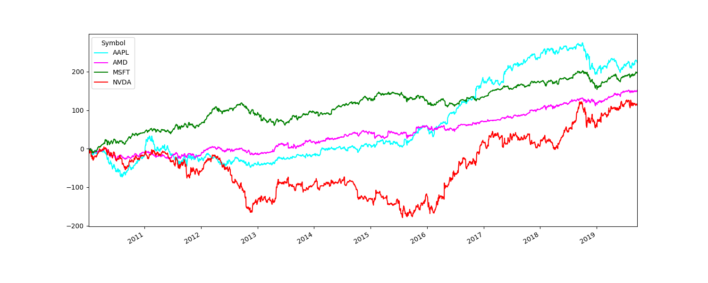

```{r setup, include=FALSE}
knitr::opts_chunk$set(echo = FALSE)
reticulate::use_python("/usr/bin/python3", required = T)
knitr::knit_engines$set(python = reticulate::eng_python)
library("reticulate")
library("tidyverse")
```

> **Disclaimer A**: La información contenida en esta página está bajo una Licencia Creative Commons Atribución-NoComercial-SinDerivadas 4.0 Internacional y fue construida bajo mi rol como ayudante (Teacher Assistant) de la Catedra Business Intelligence para las Finanzas.

> **Disclaimer B**: Este post está basado en mis propios resumenes.

> **Advertencia**: La página es un complemento a la cátedra y por nada la sustituye.

# Descargar Datos Financieros

Exiten diversos *website* donde poder descargar datos financieros (índices accionarios), *Yahoo* o *Google* por nombrar algunos. Al igual que otros lenguajes de programación, Python a través de la librería `pandas_datareader` (python 3.7) obtiene datos financieros como DataFrames. Los módulos/librerías a utilizar serán:

```{python, echo=TRUE}
import pandas as pd 
import numpy as np
import pandas_datareader.data as web
import datetime as dt
from datetime import datetime
import matplotlib.pyplot as plt
```

En este post solo se utilizará *Yahoo Finance* como fuente de datos. Para descargar más de un índice accionario, se debe crear una lista con los *tickers* o nemotécnicos (se encuentran en la página de *Yahoo Finance*) que servirá como iterador en la busqueda. Las empresas seleccionada serán FAANG (Facebook, Amazon, Apple, Netflix y Google):

| Empresa  | Nemotécnico |
|----------|-------------|
| Facebook | FB          |
| Amazon   | AMZN        |
| Apple    | AAPL        |
| Netflix  | NFLX        |
| Google   | GOOG        |

<aside>
**FAANG** o **FANG** es un acrónimo formado por el nombre comercial de las cinco grandes empresas tecnológicas cotizadas en el mercado del Nasdaq, en Estados Unidos. Inicialmente, fue FANG porque solo incluía a Facebook, Amazon, Netflix y Google, pero más tarde se incluyó Apple y se amplió a FAANG.
</aside>

```{python, echo=TRUE}
tickers = ["FB", "AMZN", "AAPL", "NFLX", "GOOG"]
```

Una vez construida la lista, se debe seleccionar la fecha de inicio y final más la frecuencia. La fecha se puede trabajar usando el módulo/librería `datetime`. Para efecto del ejercicio las fechas será desde el 1 de Enero del 2010 hasta el día de hoy con frecuencia diaria.

```{python, echo=TRUE}
start_date = dt.datetime(2010, 1, 1)
end_date = dt.datetime.today()
```

Una vez definidos los parámetros de la búsqueda se contruye una lista vacía que se irá completando en cada iteración de busqueda.

```{python, echo=TRUE}
tickers_lista = []
```

Los pasos del siguiente loop son:

1. Selecciona los tickers secuencialmente.
2. Mediante la función `web` de `pandas_datareader` descarga el índice con los parámetros del usuario.
3. Agrega una columna con el nombre del ticker para poder identificarlos.
4. Finalmente los agrega a la lista `tickers_lista`.

```{python, echo=TRUE}
for ticker in range(len(tickers)):
    panel_data = web.DataReader(tickers[ticker], "yahoo", start_date, end_date) 
    panel_data["Symbol"] = tickers[ticker]
    tickers_lista.append(panel_data)
```

Una vez terminado el *loop*, se concatena  mediante las filas cada DataFrame contenido en la lista y luego solo se selecciona solo las variables con el precio al cierre (*Close*) y *Symbol*.

```{python, echo=TRUE}
stocks_DF = pd.concat(tickers_lista, axis=0)
stocks_DF = stocks_DF.loc[:,["Close", "Symbol"]]
```

# Retornos y Retornos Acumulados

Cuando se desea calcular el retorno, se tiene dos formas, aritmética y logarítmica. Para obtener el retorno aritmético (neto):

$$
R_t = \frac{P_t-P_{t-1}}{P_{t-1}} = \frac{P_{t}}{P_{t-1}} - 1
$$
El numerador $P_t-P_{t-1}$ es la ganancia entre el periodo $t$ y $t-1$. El denominador, $P_{t-1}$, es la inversión al periodo $t-1$. A partir de lo anterior, el retorno bruto sería $\frac{P_{t}}{P_{t-1}} = 1 + R_t$. Finalmente para el caso del retorno logarítmico, se define como: 

$$
r_t = log(1 + R_t) = log(\frac{P_t}{P_{t-1}}) = p_t - p_{t-1}
$$

Donde $p_{t}=log(P_t)$ es el *log price* y $log()$ el logarítmo natural.

## Solo con un índice

En el caso de solo un índice (Amazon), se selecciona a partir de la lista construida en las secciones anteriores (`tickers_lista[0]`), luego se extrae el precio al cierre (`amzn_DF.Close`) y se construye el primer rezago (*lag*) mediante el uso de la función (`shift(1)`).

```{python, echo=TRUE}
amzn_DF = tickers_lista[0]
amzn_close = amzn_DF.Close
amzn_lag = amzn_DF.Close.shift(1)
```

Para aplicar el logarítmo natural, basta con usar la función `log` de numpy (`np.log()`). Como no tenemos el valor anterior a la primera observación de la muestra, se generará por construcción un `NA`, que se elimina usando el método (`.dropna()`).

```{python, echo=TRUE}
amzn_returns = np.log(amzn_close/amzn_lag).dropna()
amzn_returns = amzn_returns.to_frame() # a dataframe
amzn_returns.columns = ['returns'] # nombre de la columna
```

## Para todos los índices

Como se está trabajando con más de un índice, es útil construir una función capaz de realizar todo el procedimiento a un conjunto de datos.

```{python, echo=TRUE}
def returns_stocks(x):
    stock_cierre = x
    stock_cierre_lag = stock_cierre.shift(1)
    stock_returns = np.log(stock_cierre/stock_cierre_lag) # no va el dropna()
    return stock_returns
```

Una vez construido el retorno logarítmico para cada índice, se agrupa por la variable `symbol`, que contiene el nombre de los tickers o nemotécnicos y luego se aplica por columna la función `returns_stocks`. De no usar `groupby()` estaríamos trabajando los datos como si fuesen solo un índice y no cuatro.

```python
stocks_DF['Return'] = stocks_DF.groupby(['Symbol'])['Close'].apply(returns_stocks)
stocks_DF = stocks_DF.dropna()
```

Usando `loc`, seleccionamos por "etiquetas" (*labels*) las variables que contiene el nombre de los tickers o nemotécnicos y los retornos. Como en el índice (*index*) se encuentra la fecha, usando `returns_DF['Date'] = returns_DF.index`, creamos una variables llamada *Date*, que contiene la fecha.

```python
returns_DF = stocks_DF.loc[:,["Symbol", "Return"]]
returns_DF['Date'] = returns_DF.index
```
## Pivot & Melt

Uno de los objetivos de calcular el retorno, es construir y graficar los retornos acumulados. Una forma es poder pasar los datos a columnas separadas, es decir, tener cinco columnas: una con la fecha y el resto con los retornos acumulados, una forma de realizarlo es aplicar la función `.pivot()`:

```python
pivot_DF = returns_DF.pivot(index='Date', columns='Symbol', values='Return')
```

Para volver al DataFrame que se tenía se usa `.melt()`, que es la contraparte de `pivot()`:

```python
melt_DF = pd.melt(pivot_DF.reset_index(), id_vars='Date', value_vars=tickers)
melt_DF.index = melt_DF['Date']
melt_DF = melt_DF.loc[:,['Symbol', 'value', 'Date']].rename(columns={'value':'Return'})
melt_DF = melt_DF.drop(columns=['Date'])
```

## Graficar retornos acumulados

Para construir el retorno acumulado, se usa la función `.cumsum()` que calcula la suma acumulada (básicamente es lo que se quiere hacer con los retornos) y se multiplica por 100 para tenerlo en porcentaje:

```python
cumsum_returns = pivot_DF.cumsum()*100

cumsum_returns.plot(color=['cyan', 'magenta', 'green', 'red'])
plt.title("Retornos Acumulados")
plt.xlabel('Fecha')
plt.ylabel('Retorno Acumulado (%)')
plt.legend(title="Tickers")
```

> Si se está usando spyder, por defecto no muestra los gráficos en ventanas separadas. Para lograrlo basta con ir a: 
Tools > preferences > IPython console > Graphics > Graphics backend > Backend: Automatic.

```{r, fig.cap="Retornos acumulados utilizando matplotlib", fig.align='center'}

```


# Ejercicios

1. Utilizando la librería `pandas_datareader`, construya una función que le permita descargar (la fuente debe ser *Yahoo Finance*) los índices accionarios de Microsoft (**MSFT**), Nvidia (**NVDA**), AMD (**AMD**) y Apple (**AAPL**) con frecuencia, diaria desde 
el 1 de Enero del 2010 hasta hoy. 

2. Seleccione el precio al cierre (*Close*) y luego construya una función para calcular los retornos de cada índice accionario.
El retorno logarítmico se define como: 

$$
r_t = log(1 + R_t) = log(\frac{P_t}{P_{t-1}}) = p_t - p_{t-1}
$$

3. Utilice la función `pd.pivot()` de manera que cada columna (4) contenga el retorno correspondiente a cada índice accionario. El nombre de las columnas deben corresponder al nombre del nemotécnico del índice.

4. Construya los retornos acumulados y luego gráfique utilizando la librería `matplotlib`. El color de cada serie como las "capas" del gráfico quedan a su elección. 

## Enlaces

```{r, echo=FALSE, eval=TRUE}
library(fontawesome)
```

+ `r fa("download", fill = "#ee5863")` [Ayudantia](exercise/A3.pdf)
+ `r fa("python", fill = "green")` `r xfun::embed_files("jupyter_notebooks/A3.ipynb", text = "Jupyter Notebook")`
+ `r fa("google-drive", fill = "blue")` [Ver en Google Colab](https://gist.github.com/GaboCg/2d7bdfe07576a46418a88055e850c019)
+ `r fa("book", fill = "orange")` `r xfun::embed_files("scripts/A3_S.py", text = "Python Script")`