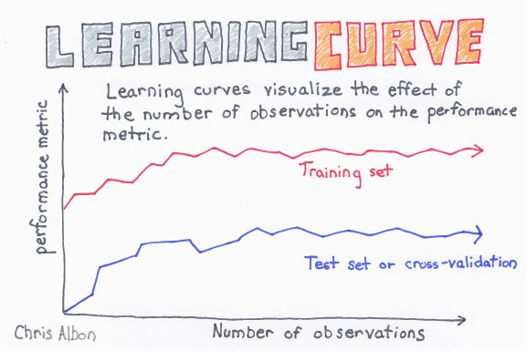
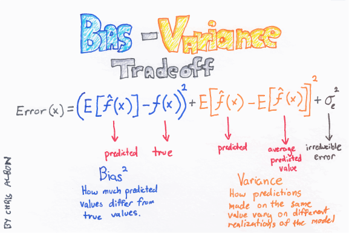
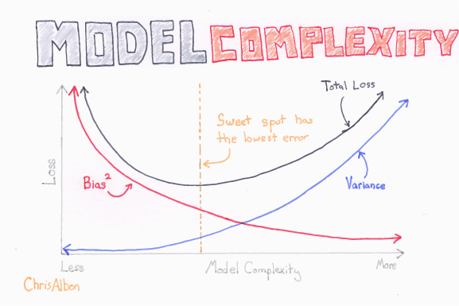

```{r setup, include=FALSE}
knitr::opts_chunk$set(echo = FALSE)
```


# ¿Por qué la Regresión Polinomial?

# *Learning Curves*

```{r, fig.align='center', fig.cap="Learning curve"}

```

# *Bias-Variance Tradeoff*

```{r, fig.align='center', fig.cap="Bias-Variance tradeoff"}

```


# *Model Complexity*

```{r, fig.align='center', fig.cap="Model Complexity"}

```

# Ejercicios 

1. Genere una variable $X$ e $y$ que contengan 100 observaciones con las siguientes características:

    a. $X = 6 \cdot \text{Aleatorio}_1 - 3$
    
    b. $y = 2 + X +  0.35 \cdot X^2 + 0.20 \cdot X^3 + \text{Aleatorio}_2$

    El parámetro $\text{Aleatorio}_1$ se refiere a la función `np.random.rand()` y $\text{Aleatorio}_2$ a la función `np.random.randn()`. Utilice una semilla igual a 42.
  
2. Vizualice los datos generados en (1).

3. Estime una regresión lineal con constante, luego: 

    a. Calcule las métricas RMSE (*Root Mean Square Error*) y $R^2$.
    
    b. Realice la predicción utilizando los parámetros $\hat{\theta}$
    encontrados en (3.a).
    
    c. Agregue la predicción al gráfico generado en (2).
    
4. Estime una regresión polinomial con grados igual a 2, 3 y 30. Para cada estimación considere:

    a. Almacene en una lista o *DataFrame* los coeficientes ($\hat{\theta}$).
    
    b. Almacene en una lista o *DataFrame* las métricas:
    
        i. RMSE (*Root Mean Square Error*). 
        ii. $R^2$.
        
    c. Grafique los datos generados y la predicción por cada grado del polinomio.
    
5. A partir de lo encontrado en (4), comparé su resultados con la regresión lineal en términos visuales, coeficientes y métricas de *performance*.

6. Genere una función que permita visualizar la *learning curves* de cada estimación realizada hasta ahora. Discuta los resultados usando los conceptos de *Underfitting* y *Overfitting*.

# Enlaces 