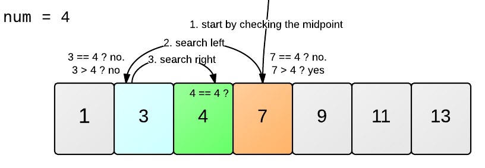

```{r setup, include=FALSE}
knitr::opts_chunk$set(echo = FALSE)
library("reticulate")
source_python('module/tictoc.py')
```

```{python}
# soluciona el path para matplotlib
import os
os.environ['QT_QPA_PLATFORM_PLUGIN_PATH'] = 'C:/Users/Habac/Anaconda3/envs/py37/Library/plugins/platforms'
```

> **Disclaimer A**: La información contenida en esta página está bajo una Licencia Creative Commons Atribución-NoComercial-SinDerivadas 4.0 Internacional y fue construida bajo mi rol como ayudante (Teacher Assistant) de la Catedra Business Intelligence para las Finanzas.

> **Disclaimer B**: Este post está basado en mis propios resumenes a partir de los capítulos del libro *Python for Data Analysis: Data Wrangling with Pandas, NumPy, and IPython*, de Wes McKinney. La mayoría de los ejemplos provienen de momento del libro.

> **Advertencia**: La página es un complemento a la cátedra y por nada la sustituye.

Cuando se realiza ciencias de datos, *machine learning* y/o *deep learning* (*computer science* en general), es 
importante encontrar el algoritmo más eficiente para resolver ciertos problema.
Pero ¿Como podemos reconocerlo? El concepto de complejidad computacional es la solución.

La complejidad computacional se mide en: 

* **Tiempo**: Número de operaciones que un algoritmo realiza para completar una tarea. Lo anterior es bajo el supuesto que cada operación se demorá el mismo tiempo.
* **Espacio**: Cantidad de memoria requerida para resolver el problema computacional.

> **Importante**: La complejidad computacional también es afectada por el sistema operativo y *hardware*.

## Iterativo & Recursivo

El concepto de iterativo y recursivo se utiliza para ejecutar instrucciones repetitivas, como los ciclos o *loops* dentro de algorítmos. Iterativo implica la repetición de un bloque de código, en donde cada iteración es independiente entre sí. Por el contrario, recursivo involucra llamar a la función una y otra vez hasta que una condición de término o salida se cumpla. A continuación se muestra la versión interativa y recursiva de la suma hasta el valor $n$.

```{python}
import timeit
```

```{python, echo=TRUE}
def sum_iterativa(n):
    num = 0
    for i in range(n+1):
      num += i
    return num
```

Aplicando la función iterativa:

```{python, echo=TRUE}
sum_iterativa(5)
```

Aplicando la función recursiva:

```{python, echo=TRUE}
def sum_recursiva(n):
    if n == 0:
        return 0
    return n + sum_recursiva(n - 1)
```

```{python, echo=TRUE}
sum_recursiva(5)
```

Es de esperar que la función recursiva se demoré más tiempo que la iterativa.

```{python, echo=TRUE}
timeit.timeit(lambda: sum_iterativa(5))
```

```{python, echo=TRUE}
timeit.timeit(lambda: sum_recursiva(5))
```

A partir de lo anterior se aprecia que así es. 

## Módulo timeit

EL módulo/librería timeit permite medir el tiempo (segundos) de ejecución de un código breve (*code snippets*) en python. ¿Por qué utilizarlo?

1. Es preciso más preciso en comparación a otros métodos.
2. Ejecuta su fragmento de código varias veces  para que obtener la medida estadísticamente más relevante del tiempo de ejecución del código.
3. Es bastante simple de usar y tiene una interfaz de línea de comandos, así como una interfaz que se puede llamar.

En las secciones siguientes los ejemplos usan `timeit`.

## La Anotación Big O 

Se usa la notación $\mathcal{O}$ para cotas superiores asintóticas, debido que va a acotar el crecimiento del tiempo de la ejecución del algoritmo por arriba para iteraciones suficientemente grandes. Lo anterior, quiere decir que si tenenemos una algoritmo que tiene un tiempo de complejidad lineal $\mathcal{O(n)}$ como es el caso de la *busqueda lineal*, no siempre se ejecutará siguiendo $\mathcal{O(n)}$ o nunca va a ser peor que $\mathcal{O(n)}$.

| Notación             | Nombre      |
|----------------------|-------------|
|$\mathcal{O(1)}$      | Constante   |
|$\mathcal{O(\log n)}$ | Logarítmico |
|$\mathcal{O(n)}$      | Lineal      |
|$\mathcal{O(n^2)}$    | Cuadratico  |
|$\mathcal{O(n!)}$     | Factorial   |

<!--  -->

# Complejidad de Tiempo

Para enteder la complejidad de tiempo, se explicarán dos algorítmos:

1. Buscador lineal

2. Secuencia de Fibonacci recursivo

## Buscador lineal

La busqueda lineal es una algoritmo para encontrar un valor objetivo de manera 
secuencial dentro de una lista. Si se construye una lista desde el 0 hasta el 9,
y se quisiera determinar la posición del número 6. Para determinar la posición, cada elemento (10) serán comparado con el número 6, hasta que sea igual 6.


La complejidad computacional en términos de tiempo es $\mathcal{O(N)}$ en promedio. 
A continuación se presenta la construcción del algóritmo y la medición del tiempo en ejecutar varías búsquedas lineales.

```{python, echo=TRUE}
import pandas as pd
import numpy as np
import matplotlib.pyplot as plt

def search(A, x):
    for i in range(0, len(A)):
        if (A[i] == x):
            return i
    return -1
```

Se construye una lista `list_iterA` y se completa mediante el *loop*:

```{python, echo=TRUE}
list_iterA = []

for n in range(1, 61, 10):
    A = list(range(0, n))
    list_iterA.append(timeit.timeit(lambda: search(A, 50)))
```

Luego utilizando `matplotlib` se grafica:

```{python, echo=TRUE, fig.align="center"}
resultadoA = pd.DataFrame(list_iterA).reset_index()
resultadoA.columns = ['iter', 'time']
resultadoA.plot(x='iter', y='time', kind='line')
```

<!-- ## Buscador binario -->

<!--  -->

## Fibonnaci recursivo

La secuencia de **Fibonacci**  es una sucesión infinita de números naturales 0, 1, 1, 2, 3, 5, 8, 13, 21, 34, 55, 89, 144, $\infty$, definida como:
$$
x_n = x_{n-1} + x_{n-2}
$$
Fibonacci es un muy buen ejemplo de una función iterativa y recursiva, debido que tiene distintos comportamiento en términos de complejidad computacional.

| Complejidad | Iterativo        | Recursivo          |
|-------------|------------------|--------------------|
| Tiempo      | $\mathcal{O(n)}$ | $\mathcal{O}(2^n)$ |
| Espacio     | $\mathcal{O(1)}$ | $\mathcal{O(n)}$   |

A continuación se presenta la construcción del algorítmo, la función se va a  definir como `fibo_rec`, debería esperarse que `fibo_rec(1) = 0`, `fibo_rec(2) = 1`, `fibo_rec(3) = 1` y así sucesivamente.

```{python, echo=TRUE}
def fibo_rec(n):
    if n <= 2:
        return 1 
    return fibo_rec(n-1) + fibo_rec(n-2)
```

Se construye una lista `list_iterB` y se completa mediante el *loop*:

```{python, echo=TRUE}
list_iterB = []

for n in range(0, 12):
    list_iterB.append(timeit.timeit(lambda: fibo_rec(n)))
```

Luego utilizando `matplotlib` se gráfica:

```{python, echo=TRUE, fig.align="center"}
resultadoB = pd.DataFrame(list_iterB).reset_index()
resultadoB.columns = ['iter', 'time']
resultadoB.plot(x='iter', y='time', kind='line')
```

## Fibonnaci recursivo usando tictoc

Otra forma de poder capturar el tiempo, es usar el módulo tictoc (basado en la función del mismo nombre de Matlab). Par cargarlo al ambiente de trabajo:

```python
from tictoc import tic, toc, toc2
```

> **Importante**: Como no es un módulo base de python, el archivo tictoc.py debe encontrarse en la carpeta que se va a trabajar.

Luego aplicamos las iteraciones correspondientes a la función de fibonacci recursivo:

```{python, echo=TRUE}
complexA = []

for i in range(1, 31):
    tic()
    fibo_value = fibo_rec(i)
    tiempo_final = toc2()
    iteracion = [i, tiempo_final]
    complexA.append(iteracion)
```

Luego utilizando matplotlib se gráfica:

```{python, echo=TRUE, fig.align="center"}
fibo_recursivo = pd.DataFrame(complexA)
fibo_recursivo.columns = ['iter', 'tiempo']
fibo_recursivo.plot(x="iter", y = "tiempo", kind='line')
plt.legend(['Recursivo'])
```

> **Importante**: Si bien ambos gráficos se parecen (timeit y tictoc), la diferencia se debe al tiempo de cada una. En el caso timeit, realiza muchas veces cada iteración y luego pasa a la siguiente, obteniendo el tiempo, en cambio tictoc, es el tiempo de una iteración.

# Complejidad de Espacio

```{python, preview=FALSE}
complexB = []
sizeA = []

for i in range(1, 31):
    fibo_value = fibo_rec(i)
    fibo_size = sys.getsizeof(fibo_value) 
    iteracion = [i, fibo_size]
    complexB.append(iteracion)
```

```{python, preview=FALSE, fig.align="center"}
fibo_comlplexity = pd.DataFrame(complexB)
fibo_comlplexity.columns = ['iter', 'size']
fibo_comlplexity.plot(x="iter", y = "size", kind='line')
plt.legend(['Recursivo'])
```

# Ejercicios

1. Genere una función que entregue la secuencia de **Fibonacci**.
$$
x_n = x_{n-1} + x_{n-2}
$$
La secuencia es una sucesión infinita de números naturales 0, 1, 1, 2, 3, 5, 8, 13, 21, 34, 55, 89, 144, $\infty$. Por ejemplo, si su función la define como `fibonacci`, debería esperarse que `fibonacci(1) = 0`, `fibonacci(2) = 1`, `fibonacci(3) = 1` y así sucesivamente.
  
2. Utilizando la función generada en (1), demuestre que la complejidad computacional en términos de tiempo para la secuencia de Fibonacci es $\mathcal{O}(2^n)$.

3. Utilizando la función generada en (1), demuestre que la complejidad computacional en términos de espacio para cada $n$ en una iteración es $\mathcal{O}(1)$.

# Enlaces
